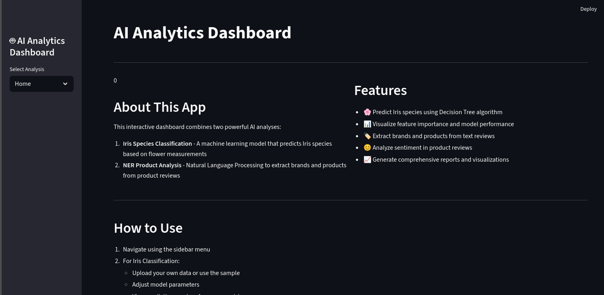
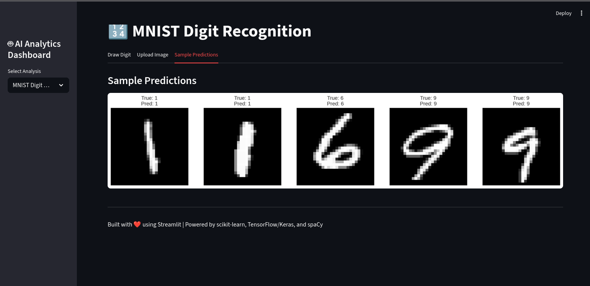

# AI Analytics Dashboard

A Streamlit web application that combines machine learning and natural language processing capabilities based on multiple analysis notebooks: Iris Species Classification, NER Product Analysis, and MNIST Handwritten Digit Recognition.

## Features

### 🌸 Iris Species Classification
- Train a Decision Tree classifier to predict Iris species
- Interactive data exploration and visualization
- Model performance metrics (accuracy, precision, recall)
- Confusion matrix and feature importance visualization
- Interactive prediction interface with sliders
- Support for custom CSV data uploads

### 🏷️ NER Product Analysis
- Extract brands and products from product reviews using spaCy
- Rule-based sentiment analysis (positive/negative/neutral)
- Named Entity Recognition visualization
- Export results as CSV
- Support for text input and file uploads

### 🖼️ MNIST Handwritten Digit Recognition
- Train a Convolutional Neural Network (CNN) to recognize handwritten digits
- Visualize model predictions on sample images
- Display accuracy metrics and training history
- Interactive prediction interface with digit drawing capabilities
- Real-time digit recognition

## Live Demo

[](https://plpaiforsoftwareengineeringweek3-cyber.streamlit.app/)

👆 **Click the badge above** to interact with the live demo of the AI Analytics Dashboard!

## Screenshots

### Iris Species Classification Interface


*Interactive prediction interface with feature importance visualization*

### NER Product Analysis Interface


*Named Entity Recognition and sentiment analysis results*

### Dashboard Overview


*Main navigation and feature selection interface*

### MNIST Digit Recognition Interface


*Handwritten digit recognition with CNN model and prediction visualization*

## Installation

### Prerequisites
- Python 3.8 or higher
- pip package manager

### Setup Steps

1. **Clone or download the repository**
   ```bash
   # If using git
   git clone <repository-url>
   cd <repository-directory>
   
   # Or download and extract the files
   ```

2. **Install dependencies**
   ```bash
   pip install -r requirements.txt
   ```

3. **Download spaCy model** (required for NER Product Analysis)
   ```bash
   python -m spacy download en_core_web_sm
   ```
   
   **If the automatic download in the app fails**, try these alternatives:
   - For conda users: `conda install -c conda-forge spacy && python -m spacy download en_core_web_sm`
   - With user flag (if you have permission issues): `python -m spacy download en_core_web_sm --user`
   - If using a virtual environment, activate it first: `source venv/bin/activate` (Linux/Mac) or `venv\\Scripts\\activate` (Windows)

4. **Ensure data files are present**
   - The app expects to find `Data/Iris.csv` for the Iris classification
   - For NER analysis, you can either enter text directly or upload files

### Running the Application

```bash
streamlit run app.py
```

The application will open in your default web browser at `http://localhost:8501`.

## Usage

### Home Page
- Overview of the application features
- Navigation instructions

### MNIST Digit Recognition
1. **Model Training**: Train the CNN model on the MNIST dataset
2. **View Results**:
   - Training and validation accuracy/loss plots
   - Confusion matrix
   - Sample predictions with true vs predicted labels
3. **Make Predictions**: Draw digits or upload images to get predictions

### Iris Classification
1. **Data Selection**: Choose between the sample dataset or upload your own CSV
2. **Model Training**: Adjust parameters and train the model
3. **View Results**: 
   - Performance metrics
   - Classification report
   - Confusion matrix
   - Feature importance chart
   - Decision tree visualization
4. **Make Predictions**: Use interactive sliders to input flower measurements and get predictions

### NER Product Analysis
1. **Input Method**: Choose between text input or file upload
2. **Enter Text**: Type or paste product review text
3. **View Analysis**:
   - Extracted brands and products
   - Sentiment analysis results
   - spaCy named entities
4. **Export Results**: Download analysis results as CSV

## Project Structure

```
.
├── app.py                 # Main Streamlit application
├── requirements.txt       # Python dependencies
├── README.md             # This file
├── Data/                 # Data directory
│   └── Iris.csv         # Iris dataset
└── notebooks/           # Original notebooks
    ├── Iris_Decision_Tree_Analysis.ipynb
    ├── NER_Product_Analysis.ipynb
    └── MNIST.ipynb
```

## Technical Details

### Iris Classification
- Algorithm: Decision Tree Classifier
- Features: Sepal length, sepal width, petal length, petal width
- Target: Iris species (setosa, versicolor, virginica)
- Visualization: Confusion matrix, feature importance, decision tree

### MNIST Digit Recognition
- Algorithm: Convolutional Neural Network (CNN)
- Architecture: 3 convolutional layers with pooling, dropout, and dense layers
- Input: 28x28 grayscale images of handwritten digits (0-9)
- Output: Probability distribution over 10 digit classes
- Metrics: Accuracy, loss visualization, prediction examples

### NER Product Analysis
- NLP Library: spaCy
- Entity Types: ORG (brands), PRODUCT (products)
- Sentiment Analysis: Rule-based with positive/negative word lists
- Extraction Methods: spaCy NER + pattern matching

## Troubleshooting


### Common Issues

1. **spaCy model not found**
   - The app will automatically download the model on first run
   - If the automatic download fails, run: `python -m spacy download en_core_web_sm`
   - For conda users: `conda install -c conda-forge spacy && python -m spacy download en_core_web_sm`
   - If you encounter permission errors, try: `python -m spacy download en_core_web_sm --user`

2. **Import errors**
   - Ensure all dependencies are installed: `pip install -r requirements.txt`
   - Check Python version (3.8+ recommended)
   - For virtual environments, activate your environment first: `source venv/bin/activate` (Linux/Mac) or `venv\\Scripts\\activate` (Windows)

3. **File not found errors**
   - Make sure `Data/Iris.csv` exists in the correct location
   - Check file permissions

4. **subprocess.CalledProcessError**
   - This error occurs when the spaCy model download fails
   - The app now includes fallback functionality that will:
     * Show detailed error messages
     * Provide a manual installation command
     * Continue with a basic NLP model (limited functionality)
   - To resolve, try installing manually with the provided command

### Performance Tips

- For large datasets in Iris classification, consider reducing the max_depth parameter
- NER analysis processes text sequentially; for very large files, consider batch processing
- MNIST model training is GPU-accelerated when available; for CPU training, consider reducing epochs

## License

This project is open source and available under the [MIT License](LICENSE).

## Contributing

Contributions are welcome! Please feel free to submit a Pull Request.

## Acknowledgments

- Built with [Streamlit](https://streamlit.io/)
- Machine Learning with [scikit-learn](https://scikit-learn.org/)
- Natural Language Processing with [spaCy](https://spacy.io/)
- Visualizations with [matplotlib](https://matplotlib.org/) and [seaborn](https://seaborn.pydata.org/)
